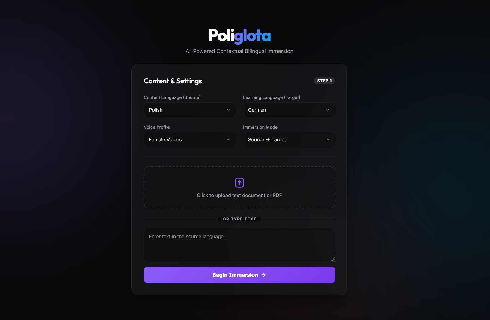
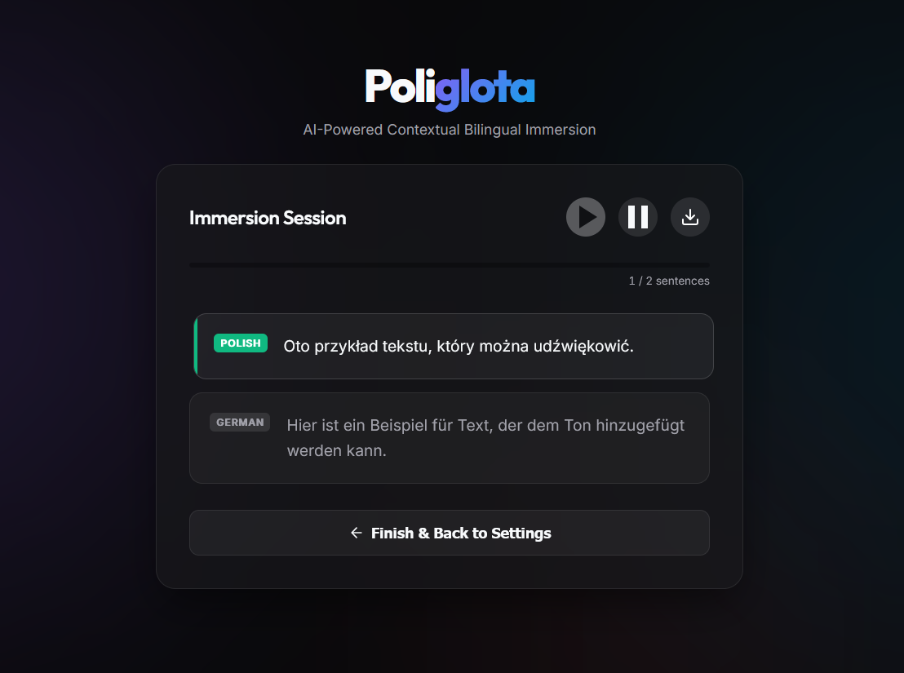

# Poliglota - Open Source Language Immersion 🎧🌍


Poliglota is a completely free, AI-powered contextual bilingual immersion tool. It allows you to parse text documents or PDFs in one language and effortlessly learn a new language by dynamically generating sequential audio in both languages using natural AI voices.



This repository is completely self-hosted, safe, and operates natively using Python. It currently supports **8 major languages**.

## 🚀 Features
- **Dynamic Translation & Text-to-Speech:** Uses high-quality Neural AI Voices (`edge-tts`) and `deep_translator`. No paid API keys required.
- **PDF & TXT Parsing:** Upload entire books or articles easily. The backend cleanly extracts and parses text using NLTK boundary detection.
- **8 Supported Languages:** 🇬🇧 English, 🇪🇸 Spanish, 🇫🇷 French, 🇩🇪 German, 🇮🇹 Italian, 🇵🇹 Portuguese, 🇵🇱 Polish, and 🇷🇺 Russian.
- **Multiple Immersion Modes:** Sequential mapping for maximum cognitive retention (`Source -> Target`, `Target -> Source`, or `Target Only`).
- **Glassmorphism UI:** A stunning, modern interface with synchronized progress bars and sentence highlighting.
- **Full Offline Export:** Export your entire generated session into a single `.mp3` file to listen to on the go.

## 🛠️ Installation

### 1. Prerequisites
Ensure you have **Python 3.10+** installed on your machine.

### 2. Clone and Install Dependencies
```bash
git clone https://github.com/lxstmai/poliglota.git
cd poliglota
pip install -r requirements.txt
```

### 3. Launch the App
```bash
python main.py
```
*Alternatively, you can run the server directly using Uvicorn:*
```bash
uvicorn main:app --host 0.0.0.0 --port 8000
```

Once running, simply open **http://localhost:8000** in your web browser.

## 🧠 How it Works
1. When you submit text, NLTK parses the syntax into logical sentences using the appropriate language tokenizer.
2. `FastAPI` routes the context to `GoogleTranslator` for immediate translation.
3. Microsoft's `edge-tts` generates high fidelity neural voice `.mp3` files which are hashed and saved into your `static/cache` directory.
4. An automated cleanup task runs in the background and silently deletes audio files older than 10 hours so your disk never accidentally overfills.

## 🔐 Disclaimer
The Open-Source version of Poliglota does not include Authentication or security limitations by default. It is meant to be run locally or over an internally secured network.

*Built with ❤️ by mai*
